# 

# **Home Lab Set Up** 

In this project, I built a virtual home lab from scratch using free virtualization software.

## **Requirements**

* Virtualization software

* ISO files for the operating systems such as Windows Server, Windows 10 and Linux Ubuntu

## **Why Virtualization?**

Virtualization is a way of running multiple computers (aka virtual machines, VMs) on a single physical computer. Instead of needing separate hardware for each system, virtualization uses software (like VirtualBox, VMware, or Proxmox) to create “virtual” versions of computers, each with its own operating system, files, and applications.

Without virtualization, testing or learning about different systems would mean setting up multiple physical machines. That’s very expensive, takes up space, and in the long run contributes to e-waste. 

Virtualization changes that by letting you run everything from your main computer (the host). You can create and remove virtual machines easily, experiment freely, and reset things without worrying about breaking your local machine.

## **Virtualization Software**

There are many virtualization software, each designed for different uses. There are paid software and free ones. For my lab, I'll be using a free (and popular) virtualization software: VirtualBox.

I've chosen VirtualBox because of its compatibility with Windows and Linux. If I were using macOS, I probably would've preferred other options.

As of the time of setting up this home lab, the current version of VirtualBox is 7.2.0. The current version might be different now that you're reading it but the interface and setup steps might not have changed much.

## **Setting up the Virtualization Software**

Before this lab, I downloaded VirtualBox from Oracle's [**website**](https://www.virtualbox.org/wiki/Downloads).

To begin the installation process, double-click on the installation file from your downloads folder. A User Account Control (UAC) screen shows up for you to grant permission for the installation.

After the UAC, I'm greeted by the VirtualBox installation splash screen below.

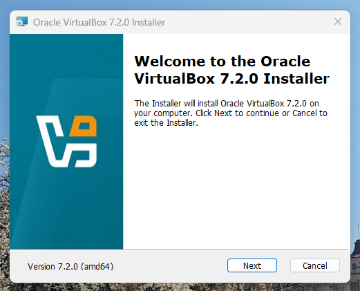

Next, I'm asked to read the terms of the license agreement. The good ol EULA that almost no one reads but we all accept and proceed 😅

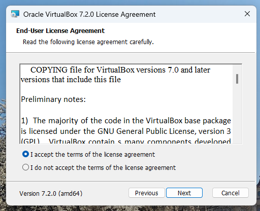

I just continue with the default options for installing VirtualBox and when the installation is done, I arrive at the home screen below.

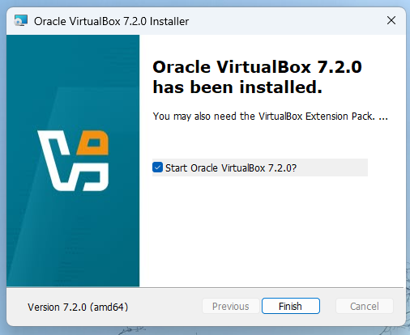

When I click **Finish** from the above screenshot, the Oracle VirtualBox Manager launches as shown below.

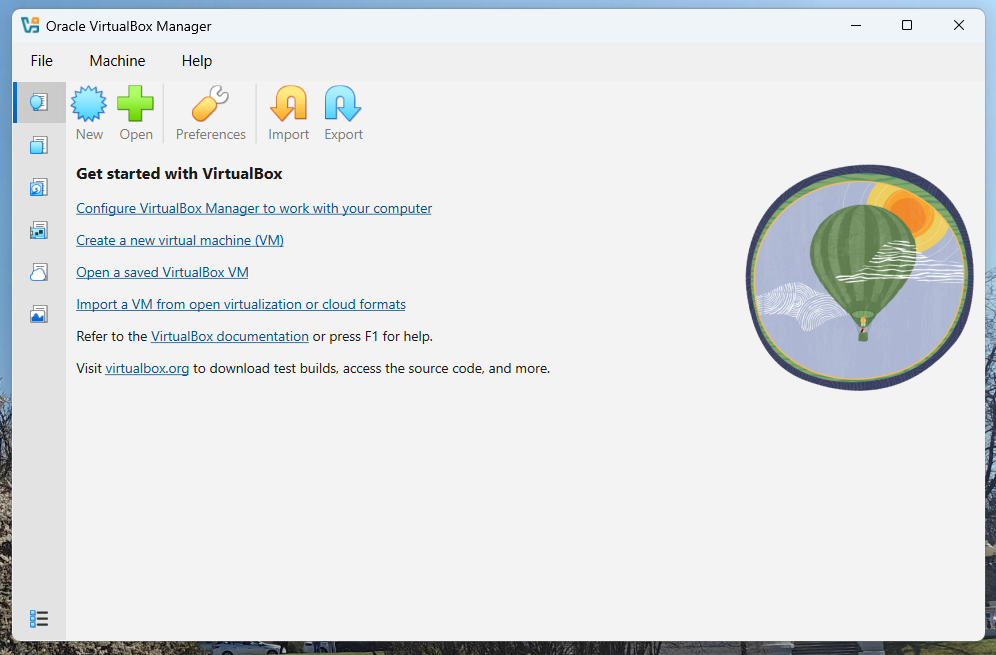

## **Creating a Virtual Machine**

On VirtualBox, you can create up to a thousand virtual machines. Isn't that sweet?

But for my home lab I won't be needing more than two or three. 

First, I’ll create a virtual machine for Windows Server. I downloaded the 2019 Windows Server ISO image file from [**here**](https://www.microsoft.com/en-us/evalcenter/evaluate-windows-server-2019). To start, I will click on the **New** button.

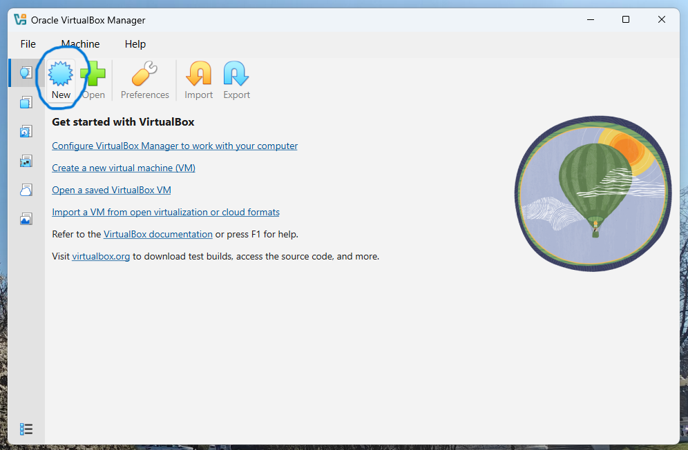

VirtualBox opens a Dialog Window with a list of configuration options.

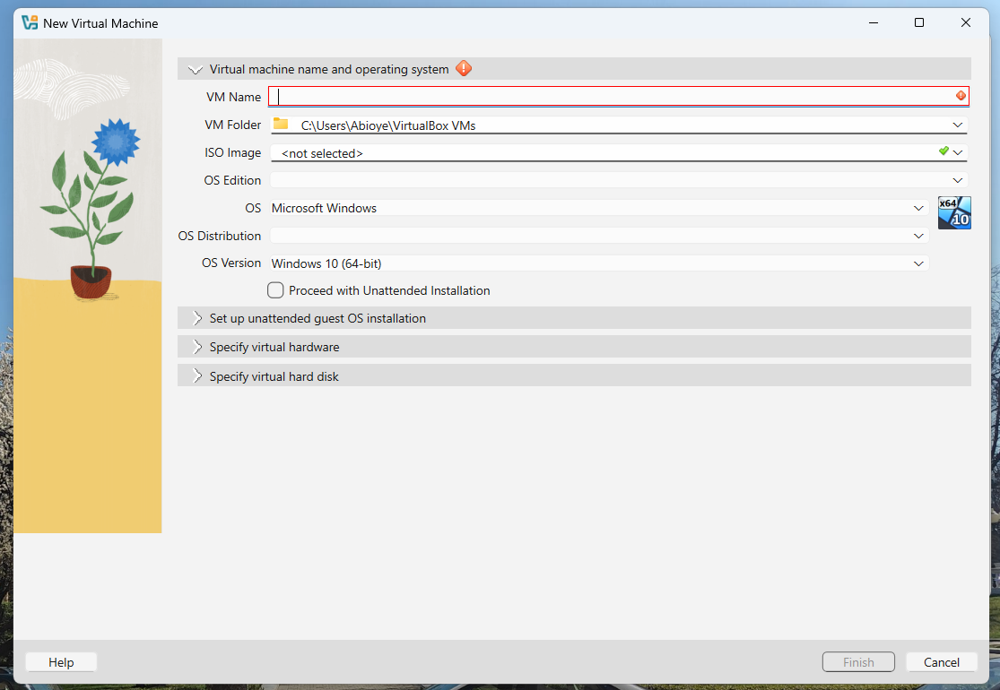

I'm required to enter a name for my machine, add the ISO image file and select other options such as the OS Version.

Once you add the image file, VirtualBox automatically populates the OS Edition and OS Distribution fields.

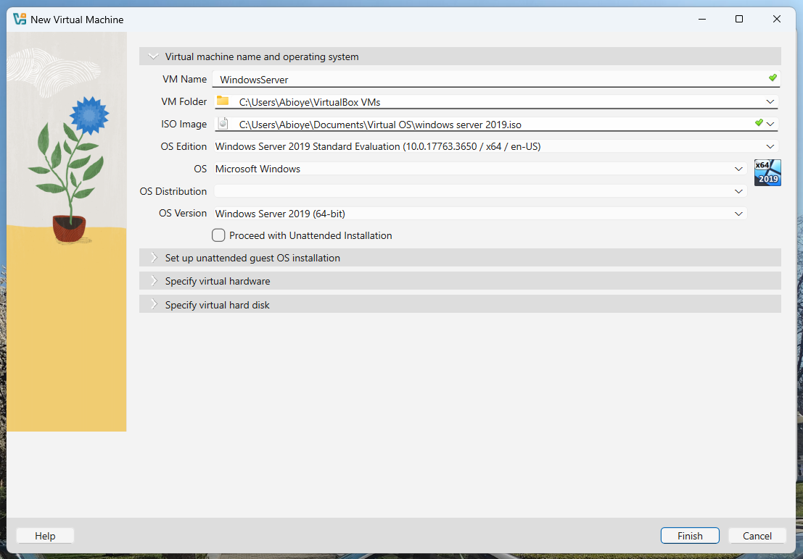

To install Windows Server, I'll leave 'Proceed with Unattended Installation' unchecked since I have to manually progress through the options in the installation process.

For the second tab, since I've chosen to attend to the installation, the options here are greyed out.

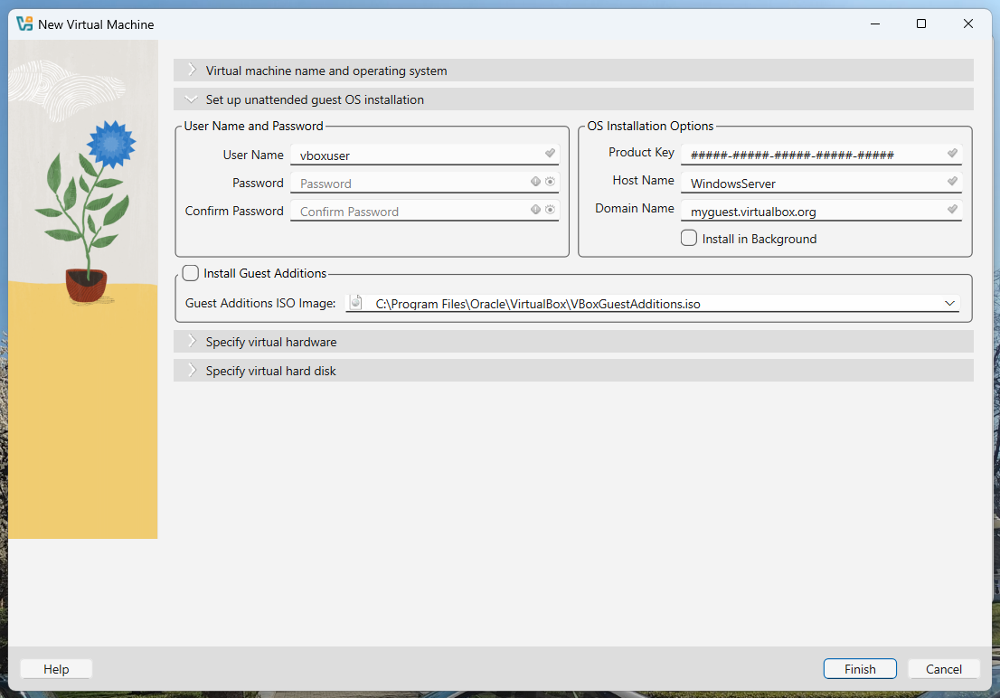

For the third tab, the VM creation process involves allocating memory and CPU. Here I can allocate up to 8GB of memory and 8 cores of CPU but due to limitation of my local machine (and the fact that I won't be doing heavy tasks in this virtual environment for now), I'll proceed with 2GB of RAM and 2 CPUs

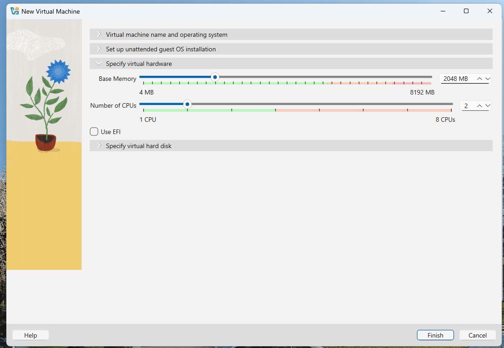

The last step of the VM creation process is to allocate storage size. I've chosen 30 GB. But as you can see from the screenshot, there is freedom to allocate up to 2 TB of storage for a virtual machine.

There are many options for the Hard Disk Type but I've chosen to proceed with [**VirtualBox Disk Image**](https://www.virtualbox.org/manual/topics/storage.html#:~:text=disk%20image%20files%3A-,VDI,-.%20Normally%2C) (VDI) as it allows for dynamic storage allocation, meaning that the 30GB I've allocated for this VM will not be immediately chunked off my local hard disk drive but it will gradually fill up files in the VDI up to 30GB.

The Pre-allocate Full Size option just means doing the opposite of the above.

The Split Disk Into 2 GB Parts option can only be checked when you select Virtual Machine Disk file type, enabling you to split the large disk image of the VMDK into 2GB chunks on your local disk drive.

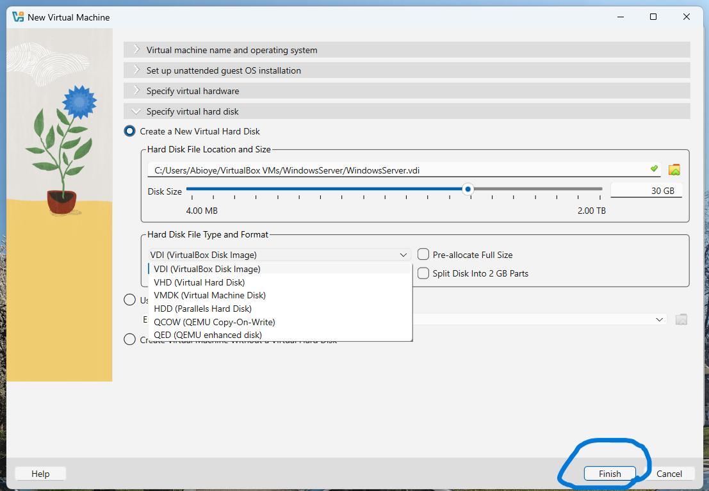

Once I'm done with the options for the VM, I'll click on the Finish button.

And voila\! First virtual machine created. In a real-world scenario, I'll have to buy a workstation or high-end computer to run Windows Server. But virtualization makes it possible without the cost of acquiring another machine.

The WindowsServer machine now appears on my list of Virtual Machines.

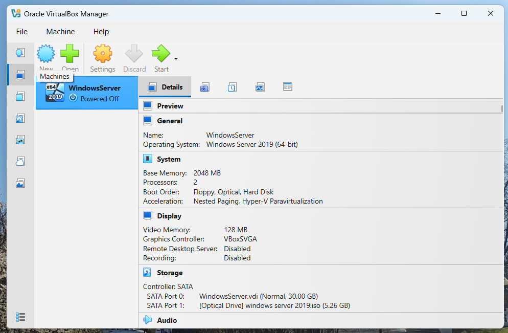

From here, I can further adjust the settings (aka specifications) of my machine. To do that, right click on the WindowsServer machine and click on Settings.

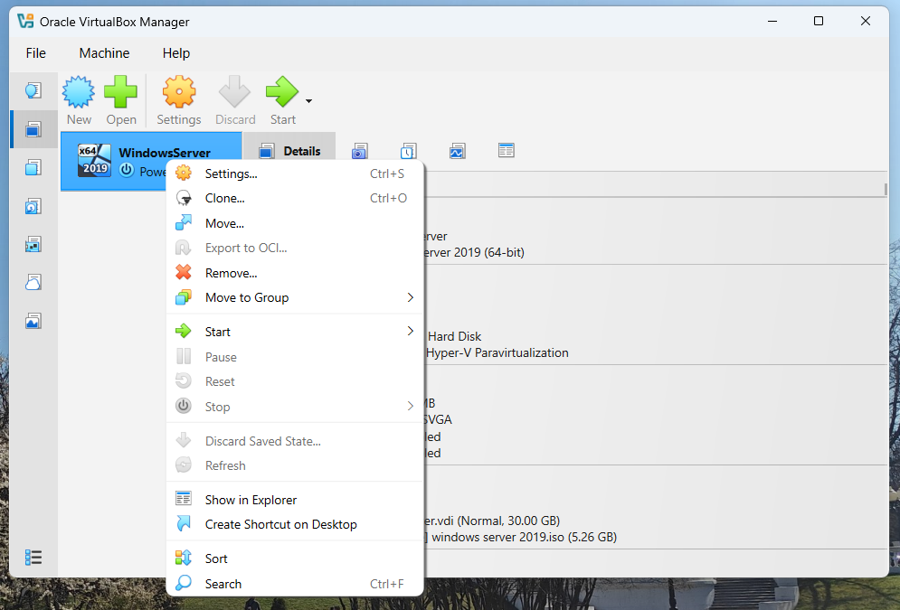

The settings screen has Basic and Expert mode.

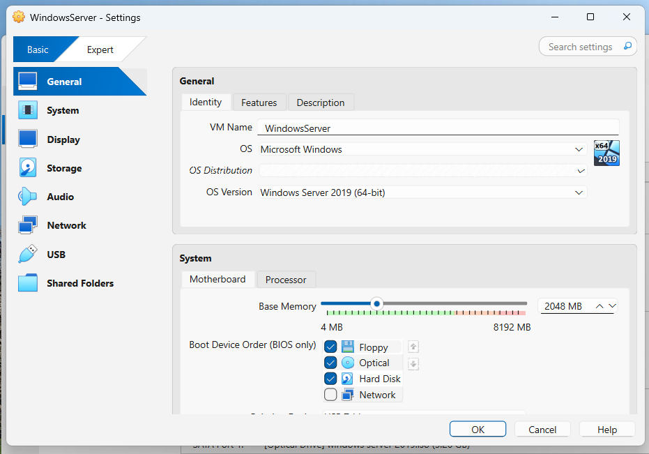

Here you can modify the following:

* VM settings such as VM name, Clipboard sharing, Drag and Drop options.  
* VM resources like RAM, CPU and storage  
* Audio settings

And most importantly, the Network settings. 

The Network settings enables you to choose different [**network adapters**](https://www.virtualbox.org/manual/ch06.html#:~:text=Each%20of%20the-,networking%20adapters,-can%20be%20separately) based on the network communication needs of each virtual machine. In the Basic mode, there are only two possible Network Adapter options but when you switch to Expert mode, you'll get more Network adapters.

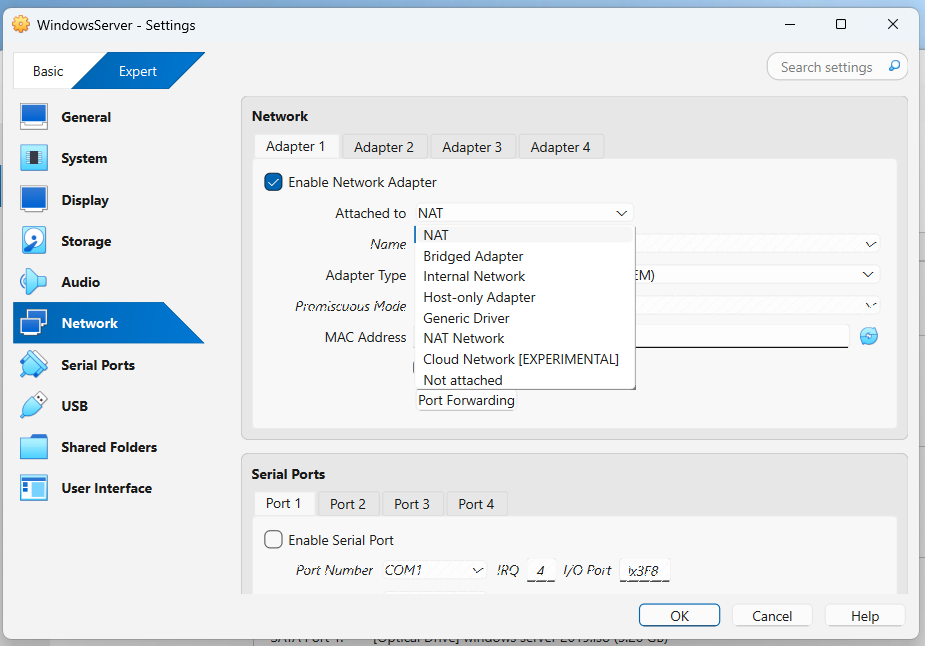

The options available are:

* **NAT (Network Address Translation):** This lets the virtual machine share your computer’s internet connection. It’s easy to set up and keeps your VM hidden from your local network.  
* **Bridged Adapter:** A bridged adapter connects your VM directly to your local network. It behaves like another real device with its own IP address.  
* **Internal Network:** This creates a private network just for your virtual machines. They can talk to each other but have no access to the internet or your real network.  
* **Host-Only Adapter:** With this option, the VM can communicate only with your main computer and other VMs using the same setting. It’s great for local testing without internet access.  
* **Generic Driver:** This one allows you to use custom or special networking drivers. It’s usually for advanced or experimental setups.  
* **NAT Network:** Similar to NAT, but it lets multiple VMs share the same virtual network while still accessing the internet. It’s useful when you want your VMs to talk to each other and stay isolated from your physical network.

Let's continue with setting up the VM. I will double click the WindowServer VM from the list of VMs to power on the machine. The machine comes up and loads the files and I'll proceed with the setup from below.

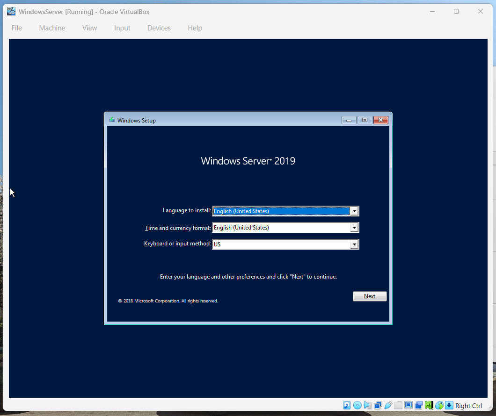

Next up, I'll create a virtual machine for a Linux and a Windows 10 machine.

Creating the virtual machine begins with the same process as earlier outlined.

However, for Linux we can proceed with Unattended Installation. This means the virtual machine will initialize the OS installation once it has been successfully created.

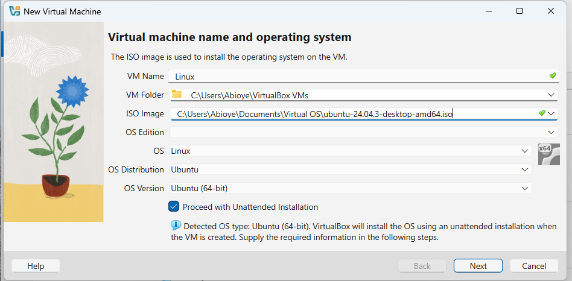

After typing the desired VM name and selecting the ISO to allow the field populate automatically, I clicked on Next and it takes me to the screen where I'll create a user and password for the user.

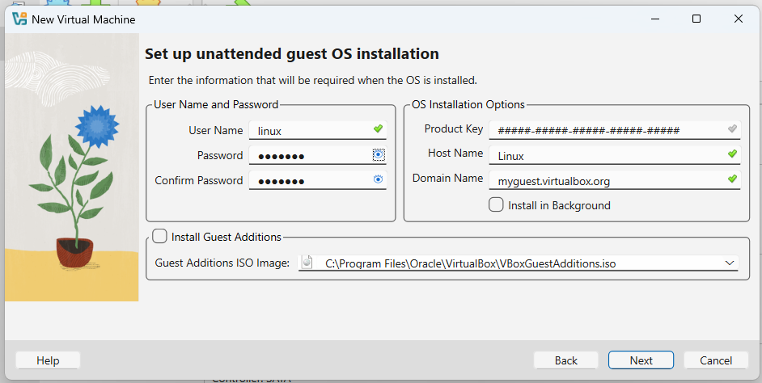

After defining the hardware specification and other VM settings, I click on Finish in the below screenshot. This completes the VM creation and begins the installation of Ubuntu.

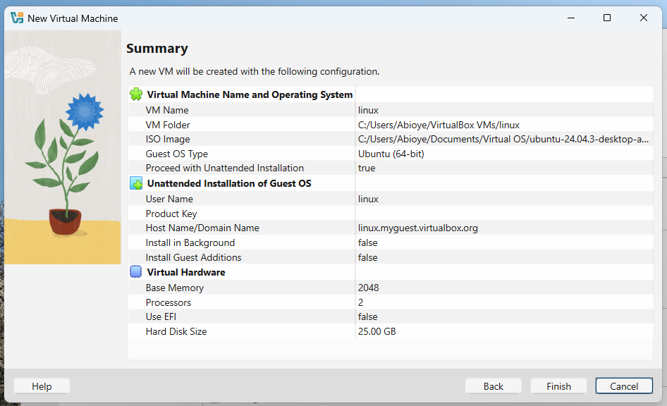

Ubuntu will install and prompt me to enter the password created during the VM creation process.

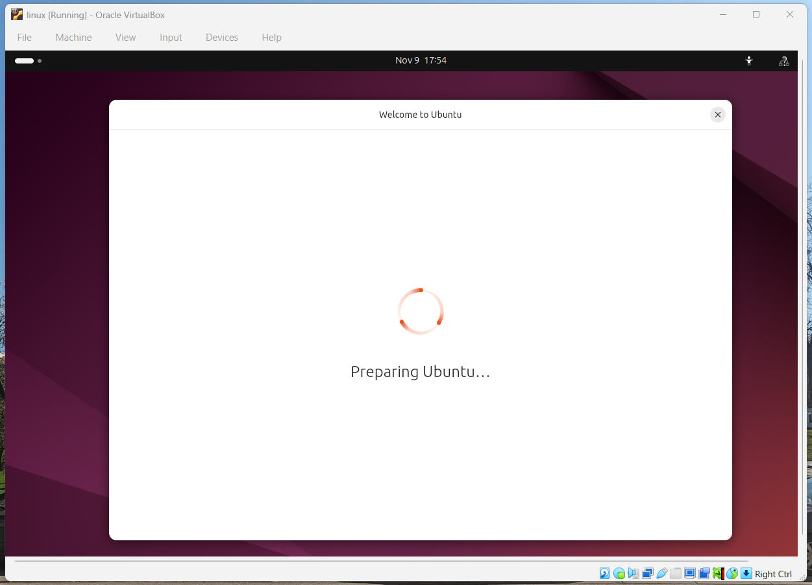

And with that, I'll just repeat the same process whether for Windows or another flavor of a Linux operating system.